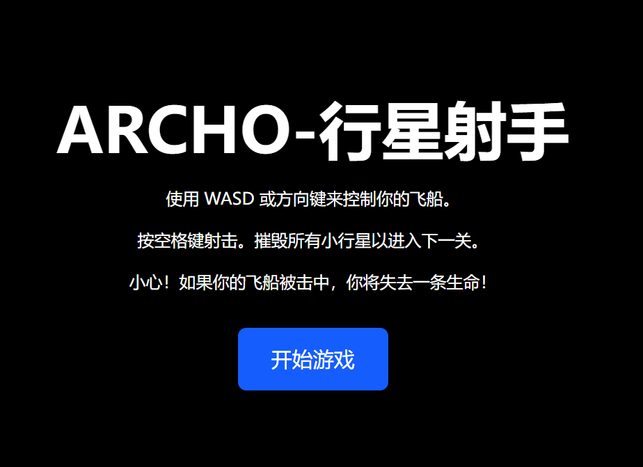
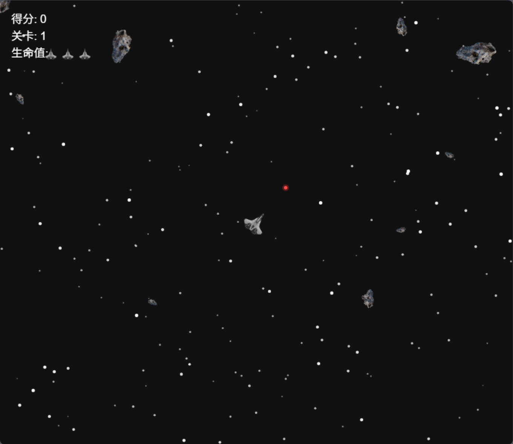
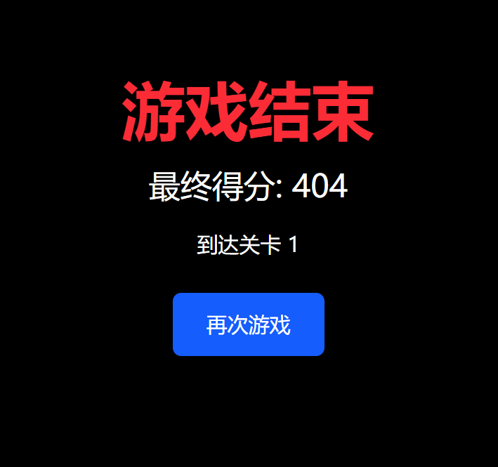

# Archo

A morden **Asteroid Shooter** game built using **React.js** and the **HTML5 Canvas API**. Players control a spaceship to shoot and destroy incoming asteroids while avoiding collisions. The game features smooth controls, sound effects, and increasing difficulty.

一个代**小行星的射手**游戏建造**React.js**与**HTML5 Canvas API**. 玩家控制飞船到射击和摧毁进入小行星的同时，避免碰撞。 游戏功能流畅的控制，音效，以及越来越多的困难。

## 汉化说明

当前汉化仅适用于 版本：

首先感谢原作者的开源。[原项目地址](https://github.com/Balaji-R-2007/archo)

具体汉化了那些内容，请参考[翻译说明](./翻译说明.md)。

我看不懂代码，所以只做汉化，有问题，请到原作者仓库处反馈。

本人提供这个项目在 NAS、服务器等的有偿远程部署服务，有需要可联系。  
微信号 `E-0_0-`  
闲鱼搜索用户 `明月人间`  
或者邮箱 `firfe163@163.com`  
如果这个项目有帮到你。欢迎start。

有其他的项目的汉化需求，欢迎提issue。或其他方式联系通知。

### 部署汉化项目

1.  从阿里云镜像仓库拉取镜像，注意填写镜像标签，镜像仓库中没有`latest`标签
    ```bash
    docker pull crpi-aiy5xfxuied4b3f9.cn-chengdu.personal.cr.aliyuncs.com/firfe/archo_zh-cn:2025.04.18
    ```
2.  部署  
    可通过设置环境变量`MINISERVE_PORT`的值来指定监听端口
    - 命令部署
        ```bash
        docker run -d \
        --name archo_zh-cn \
        --network bridge \
        --restart always \
        --log-opt max-size=1m \
        --log-opt max-file=3 \
        -p 9263:9263 \
        crpi-aiy5xfxuied4b3f9.cn-chengdu.personal.cr.aliyuncs.com/firfe/archo_zh-cn:2025.04.18
        ````
    - `compose.yaml`文件部署 👍推荐
        ```yaml
        #version: '3.9'
        services:
          archo_zh-cn:
            container_name: archo_zh-cn
            image: crpi-aiy5xfxuied4b3f9.cn-chengdu.personal.cr.aliyuncs.com/firfe/archo_zh-cn:2025.04.18
            network_mode: bridge
            restart: always
            logging:
              options:
                max-size: 1m
                max-file: '3'
            ports:
              - 9263:9263
        ```
## 修改说明

这里对除了汉化之外的代码修改的说明。  
增加修改部分具体见 [修改说明](./修改说明.md)。

`./README.md` 文件翻译，增加 `## 汉化说明`、`## 修改说明`、`## 汉化效果截图`、`## 我的二维码` 部分。

增加目录 `./图片`
新增文件 `./翻译说明.md`、`./修改说明.md`  

## 汉化效果截图

首页


游戏界面


游戏结束


## Features 特性

- 🚀 **Player-controlled spaceship** with movement and shooting mechanics  
  🚀 玩家控制的宇宙飞船，具有移动和射击机制
- 🪨 **Randomly spawning asteroids** with increasing difficulty  
  🪨 随机生成的小行星，难度逐渐增加
- 🔫 **Laser shooting system** to destroy asteroids  
  🔫 激光射击系统 用于摧毁小行星
- 🎵 **Sound effects** for immersive gameplay  
  🎵 音效 提供沉浸式游戏体验
- 🏆 **Score tracking system**  
  🏆 得分追踪系统
- 🎮 **Game over & restart functionality**  
  🎮 游戏结束与重新开始功能

## Installation & Setup 安装与设置

1. **Clone the repository** 克隆仓库

   ```bash
   git clone https://github.com/your-username/asteroid-shooter.git
   cd asteroid-shooter
   ```

2. **Install dependencies** 安装依赖

   ```bash
   npm install
   ```

3. **Run the game** 运行游戏

   ```bash
   npm start
   ```

4. Open your browser and play the game at `http://localhost:1234`  
   打开浏览器并在 http://localhost:1234 开始游戏

## Controls 控制方式

- **Arrow Keys or WASD** - Move the spaceship 方向键或WASD - 移动宇宙飞船
- **Spacebar** - Shoot lasers 空格键 - 发射激光
- **Esc** - Pause the game Esc - 暂停游戏

## Future Improvements 未来改进

- 🎨 Add better animations and UI effects 添加更佳的动画和UI效果
- 🌍 Implement a high-score leaderboard 实现高分排行榜
- 📱 Make the game mobile-friendly 使游戏支持移动端
- 🔥 Add power-ups and different enemy types 添加能量提升道具和不同的敌人类型

## Contributing 贡献

Contributions are welcome! Feel free to fork the repo, make changes, and submit a pull request.

欢迎任何形式的贡献！随意fork仓库、作出更改并提交pull请求。

## License 许可证

This project is licensed under the **MIT License**.

本项目基于 MIT许可证 授权。

Happy gaming! 🎮🚀 祝你游戏愉快！ 🎮🚀
